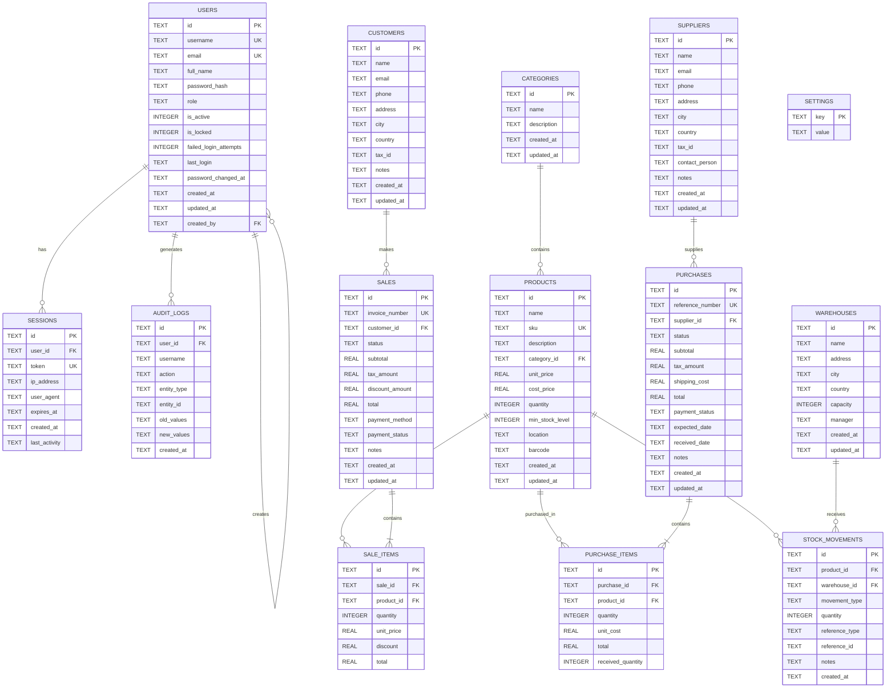
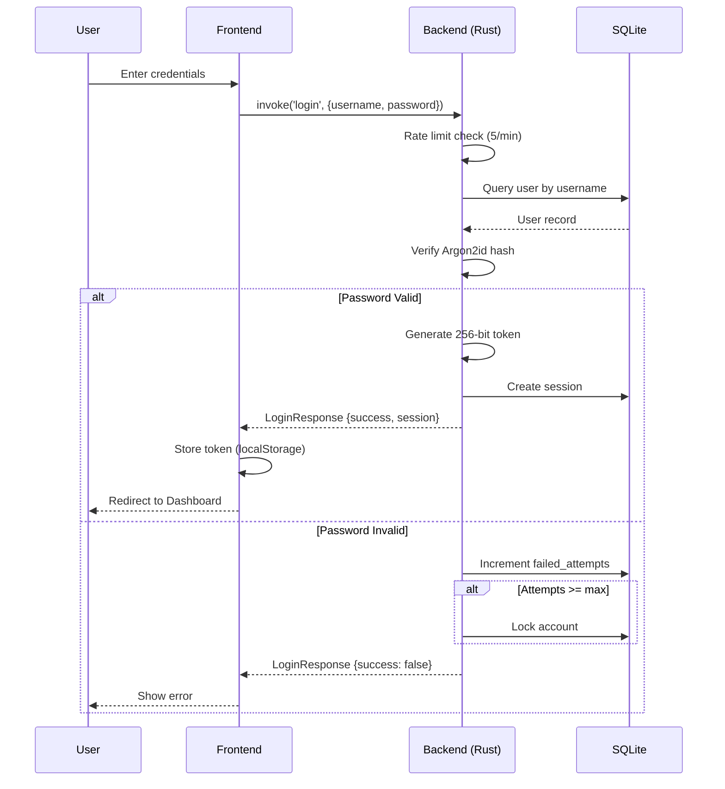
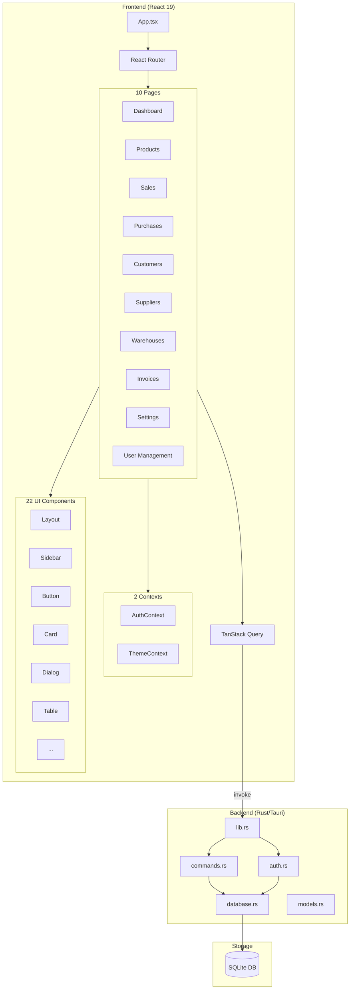
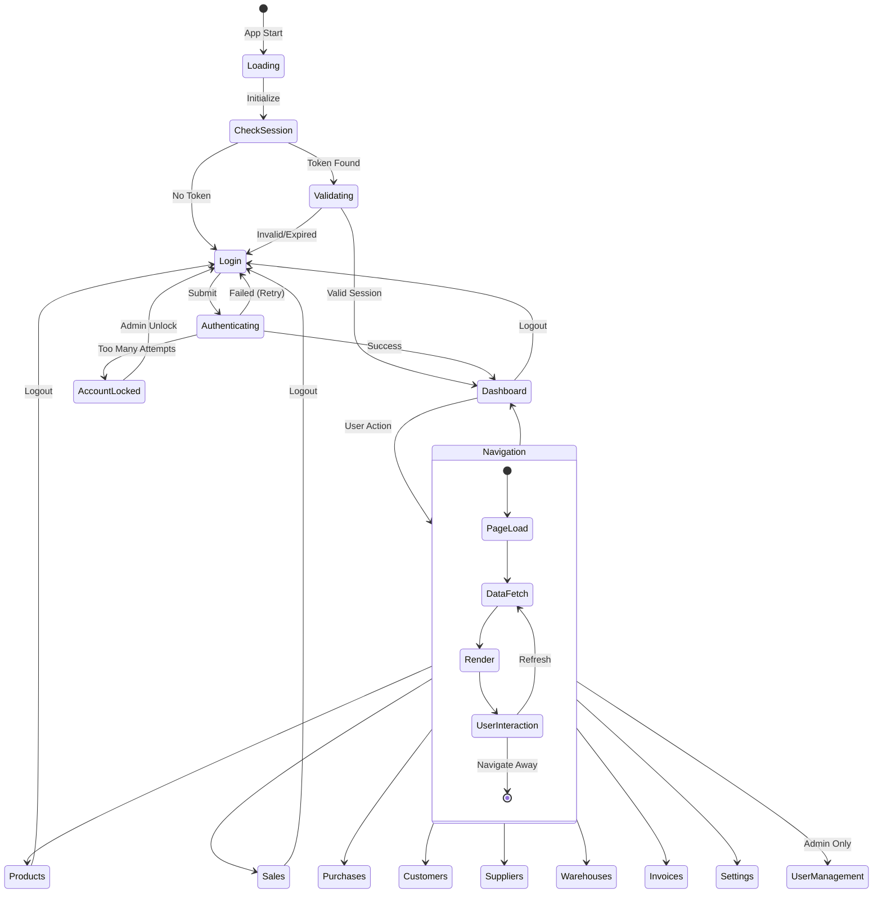
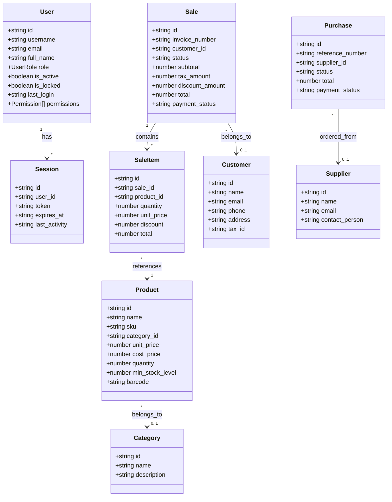

# 📦 InventoryERP - Enterprise Inventory & Management System

<div align="center">


**A modern, secure, and performant desktop ERP application built with Tauri, React, and Rust.**

[Features](#-features) • [Architecture](#-architecture) • [Version Management](#-version-management) • [Installation](#-installation) • [Security](#-security) • [Database](#-database-architecture) • [Roadmap](#-roadmap)

</div>

---

## 📋 Table of Contents

- [Overview](#-overview)
- [Features](#-features)
- [Technology Stack](#-technology-stack)
- [Architecture](#-architecture)
- [Database Architecture](#-database-architecture)
- [Security](#-security)
- [Version Management](#-version-management)
- [Installation](#-installation)
- [Configuration](#-configuration)
- [API Reference](#-api-reference)
- [UML Diagrams](#-uml-diagrams)
- [Roadmap - Future Development](#-roadmap---future-development)
- [Contributing](#-contributing)

---

## 🎯 Overview

**InventoryERP** is a comprehensive enterprise resource planning (ERP) solution designed for small to medium businesses. It provides complete inventory management, sales tracking, purchase orders, customer/supplier management, and financial reporting - all in a secure, offline-capable desktop application.

### Why InventoryERP?

| Feature | Benefit |
|---------|---------|
| 🖥️ **Desktop Native** | No internet required, data stays on your machine |
| ⚡ **Lightning Fast** | Rust backend + SQLite = millisecond responses |
| 🔒 **Enterprise Security** | Argon2id hashing, RBAC, session management |
| 🎨 **Modern UI** | Beautiful dark/light themes with smooth animations |
| 🌍 **Multi-Language** | Full i18n support (English 🇺🇸, French 🇫🇷) |
| 📦 **Portable** | Single executable, ~15MB installed |

---

## ✨ Features

### Core Modules

#### 📊 Dashboard
- Real-time KPI widgets (revenue, orders, stock levels)
- Interactive charts with Recharts
- Top-selling products analytics
- Low stock alerts
- Recent sales activity feed

#### 📦 Product Management
- Complete product catalog with SKU/barcode support
- Category organization
- Cost and selling price tracking
- Minimum stock level alerts
- Bulk import/export capabilities
- Product search with filters

#### 💰 Sales Management
- **Quick Sell POS** - Keyboard-driven point of sale
- Invoice generation with customizable prefixes
- Customer association
- Multiple payment methods
- Discount and tax calculations
- Sales history with filtering

#### 🛒 Purchase Orders
- Supplier order management
- Expected delivery tracking
- Partial receiving support
- Automatic stock updates on receiving
- Purchase history and reporting

#### 👥 Customer Management
- Customer database with contact details
- Purchase history per customer
- Notes and communication log
- Tax ID tracking for B2B

#### 🏭 Supplier Management
- Supplier catalog
- Contact person tracking
- Order history per supplier
- Payment terms management

#### 🏢 Warehouse Management
- Multi-warehouse support
- Capacity tracking
- Manager assignment
- Stock location mapping

#### 📄 Invoice Management
- Professional invoice generation
- Payment status tracking
- Invoice history and search

#### 📦 Batch/Lot Tracking
- **Complete batch lifecycle management**
  - Create batches with unique batch numbers
  - Track lot numbers for regulatory compliance
  - Manufacturing and expiry date tracking
- **Expiration monitoring**
  - Dashboard showing expiring batches (30-day warning)
  - Expired batch alerts with visual indicators
  - Days until expiry calculation
- **Movement history**
  - Track all batch quantity changes
  - Receipt, sale, adjustment, and transfer logging
  - Complete audit trail per batch
- **Batch status management**
  - Active, Depleted, Expired, Recalled, Quarantine statuses
  - Visual status badges with color coding
- **Statistics dashboard**
  - Total, active, expiring, expired batch counts
  - Low stock batch alerts
- **Warehouse and supplier linking**
  - Associate batches with specific warehouses
  - Track supplier source for each batch

#### ⚙️ Settings
- Company information
- Currency and tax configuration
- Invoice/PO number prefixes
- **Appearance** - Light/Dark/System theme
- Session timeout configuration

#### 👤 User Management (Admin Only)
- User CRUD operations
- Role-Based Access Control (RBAC)
- Account locking/unlocking
- Password reset
- Audit log viewing
- Bulk user operations

### Advanced Features

| Feature | Description |
|---------|-------------|
| 🎨 **Theme System** | Light, Dark, and System-follow modes with smooth transitions |
| 🌍 **Multi-Language (i18n)** | Full internationalization with English and French support, user preference persistence |
| ⌨️ **Keyboard Shortcuts** | F2 (Search), F3 (Complete Sale), F4 (Clear), 1-9 (Categories) |
| 📱 **Responsive Design** | Adaptive layouts for different screen sizes |
| 🔄 **Real-time Updates** | React Query with smart caching and background refresh |
| 🎭 **Animated UI** | Framer Motion powered transitions and micro-interactions |
| 📊 **Statistics Cards** | Trend indicators with up/down badges |
| 🔍 **Advanced Search** | Unified search component across all modules |

### 🌍 Internationalization (i18n)

InventoryERP supports multiple languages with user preference persistence:

| Language | Flag | Status | Coverage |
|----------|------|--------|----------|
| **English** | 🇺🇸 | ✅ Complete | 100% |
| **French** | 🇫🇷 | ✅ Complete | 100% |

#### Key Terms Translation Reference

| English | French | Description |
|---------|--------|-------------|
| Dashboard | Tableau de bord | Main overview screen |
| Products | Produits | Inventory items management |
| Sales | Ventes | Point of sale and orders |
| Purchases | Achats | Supplier order management |
| Customers | Clients | Customer relationship data |
| Suppliers | Fournisseurs | Vendor management |
| Warehouses | Entrepôts | Storage location tracking |
| Invoices | Factures | Billing documents |
| Settings | Paramètres | System configuration |
| User Management | Gestion des utilisateurs | Access control |
| Batch/Lot Tracking | Suivi des lots | Track products by batch number |
| Stock | Stock | Inventory quantity |
| Low Stock Alert | Alerte de stock bas | Reorder notifications |
| Expiry Date | Date d'expiration | Product shelf life |

---

## 🛠️ Technology Stack

### Frontend

| Technology | Version | Purpose |
|------------|---------|---------|
| **React** | 19.1.0 | UI Framework |
| **TypeScript** | 5.8.3 | Type Safety |
| **Tailwind CSS** | 4.1.18 | Styling |
| **Vite** | 7.0.4 | Build Tool |
| **React Router** | 7.12.0 | Navigation |
| **TanStack Query** | 5.90.19 | Data Fetching & Caching |
| **Framer Motion** | 12.28.1 | Animations |
| **Recharts** | 3.6.0 | Data Visualization |
| **Lucide React** | 0.562.0 | Icons |
| **Radix UI** | Latest | Accessible Primitives |
| **date-fns** | 4.1.0 | Date Utilities |

### Backend

| Technology | Version | Purpose |
|------------|---------|---------|
| **Tauri** | 2.x | Desktop Framework |
| **Rust** | 1.75+ | Backend Language |
| **SQLite** | 3.x (rusqlite 0.31) | Database |
| **Argon2** | 0.5 | Password Hashing |
| **Chrono** | 0.4 | Date/Time |
| **UUID** | 1.x | ID Generation |
| **Tokio** | 1.x | Async Runtime |
| **lazy_static** | 1.4 | Static Variables |

### UI Component Library

Custom shadcn/ui inspired components:
- `Button`, `Input`, `Select`, `Dialog`, `Tabs`
- `Card`, `GlassCard` (with blur effects)
- `Badge`, `Table`, `ScrollArea`
- `AnimatedTabs`, `StatisticCard`
- `LoadingSpinner`, `Skeleton` systems
- `SearchInput` (unified search)
- `PageHeader` (consistent headers)

---

## 🏗️ Architecture

### System Architecture

```
┌─────────────────────────────────────────────────────────────────┐
│                        InventoryERP                             │
├─────────────────────────────────────────────────────────────────┤
│  ┌─────────────────────────────────────────────────────────┐   │
│  │                    FRONTEND (React)                      │   │
│  │  ┌──────────┐ ┌──────────┐ ┌──────────┐ ┌──────────┐   │   │
│  │  │ Pages    │ │Components│ │ Contexts │ │  Hooks   │   │   │
│  │  │          │ │          │ │          │ │          │   │   │
│  │  │Dashboard │ │  ui/     │ │  Auth    │ │  useQuery│   │   │
│  │  │Products  │ │  layout/ │ │  Theme   │ │  useMemo │   │   │
│  │  │Sales     │ │          │ │          │ │          │   │   │
│  │  │Purchases │ │          │ │          │ │          │   │   │
│  │  │Customers │ │          │ │          │ │          │   │   │
│  │  │Suppliers │ │          │ │          │ │          │   │   │
│  │  │Warehouses│ │          │ │          │ │          │   │   │
│  │  │Settings  │ │          │ │          │ │          │   │   │
│  │  │UserMgmt  │ │          │ │          │ │          │   │   │
│  │  └──────────┘ └──────────┘ └──────────┘ └──────────┘   │   │
│  └─────────────────────────────────────────────────────────┘   │
│                              │                                  │
│                    Tauri IPC (invoke)                          │
│                              │                                  │
│  ┌─────────────────────────────────────────────────────────┐   │
│  │                    BACKEND (Rust)                        │   │
│  │  ┌──────────┐ ┌──────────┐ ┌──────────┐ ┌──────────┐   │   │
│  │  │ Commands │ │  Auth    │ │ Database │ │  Models  │   │   │
│  │  │          │ │          │ │          │ │          │   │   │
│  │  │ CRUD Ops │ │ Login    │ │ SQLite   │ │ Product  │   │   │
│  │  │ Reports  │ │ Sessions │ │ Mutex    │ │ Sale     │   │   │
│  │  │ Stock    │ │ RBAC     │ │ Indexes  │ │ Purchase │   │   │
│  │  │          │ │ Audit    │ │          │ │ User     │   │   │
│  │  └──────────┘ └──────────┘ └──────────┘ └──────────┘   │   │
│  └─────────────────────────────────────────────────────────┘   │
│                              │                                  │
│  ┌─────────────────────────────────────────────────────────┐   │
│  │                    DATABASE (SQLite)                     │   │
│  │   inventory.db stored in app data directory             │   │
│  └─────────────────────────────────────────────────────────┘   │
└─────────────────────────────────────────────────────────────────┘
```

### File Structure

```
InventoryERP/
├── 📁 src/                          # React Frontend
│   ├── 📁 components/
│   │   ├── 📁 layout/
│   │   │   ├── Layout.tsx           # Main app layout with sidebar
│   │   │   └── Sidebar.tsx          # Navigation sidebar
│   │   ├── 📁 ui/                   # Reusable UI components (22 files)
│   │   │   ├── animated-tabs.tsx    # Animated tab component
│   │   │   ├── badge.tsx            # Status badges
│   │   │   ├── button.tsx           # Button variants
│   │   │   ├── card.tsx             # Card component
│   │   │   ├── dialog.tsx           # Modal dialogs
│   │   │   ├── glass-card.tsx       # Glassmorphism cards
│   │   │   ├── input.tsx            # Form inputs
│   │   │   ├── loading-spinner.tsx  # Loading indicators
│   │   │   ├── loading-system.tsx   # Skeleton loaders
│   │   │   ├── page-header.tsx      # Consistent page headers
│   │   │   ├── search-input.tsx     # Unified search component
│   │   │   ├── select.tsx           # Dropdown selects
│   │   │   ├── statistic-card.tsx   # KPI stat cards
│   │   │   ├── table.tsx            # Data tables
│   │   │   └── ...                  # More UI components
│   │   └── ProtectedRoute.tsx       # Route guard component
│   ├── 📁 contexts/
│   │   ├── AuthContext.tsx          # Authentication state (319 lines)
│   │   └── ThemeContext.tsx         # Theme management
│   ├── 📁 lib/
│   │   ├── api.ts                   # Tauri invoke wrappers (198 lines)
│   │   └── utils.ts                 # Utility functions
│   ├── 📁 pages/
│   │   ├── Dashboard.tsx            # Main dashboard (542 lines)
│   │   ├── Products.tsx             # Product management (579 lines)
│   │   ├── Sales.tsx                # Sales & Quick Sell POS (1254 lines)
│   │   ├── Purchases.tsx            # Purchase orders
│   │   ├── Customers.tsx            # Customer management
│   │   ├── Suppliers.tsx            # Supplier management
│   │   ├── Warehouses.tsx           # Warehouse management
│   │   ├── Invoices.tsx             # Invoice management
│   │   ├── Settings.tsx             # App settings
│   │   ├── UserManagement.tsx       # User & role management (1300+ lines)
│   │   └── Login.tsx                # Authentication page
│   ├── 📁 types/
│   │   └── index.ts                 # TypeScript interfaces (368 lines)
│   ├── App.tsx                      # Root component with routing
│   ├── main.tsx                     # Entry point
│   └── index.css                    # Global styles + Tailwind
├── 📁 src-tauri/                    # Rust Backend
│   ├── 📁 src/
│   │   ├── main.rs                  # Tauri entry point
│   │   ├── lib.rs                   # Command registration (102 lines)
│   │   ├── commands.rs              # Business logic commands (1000 lines)
│   │   ├── auth.rs                  # Authentication system (1094 lines)
│   │   ├── database.rs              # SQLite management (454 lines)
│   │   └── models.rs                # Data structures (634 lines)
│   ├── Cargo.toml                   # Rust dependencies
│   └── tauri.conf.json              # Tauri configuration
├── package.json                     # Node dependencies
├── tailwind.config.js               # Tailwind configuration
├── tsconfig.json                    # TypeScript config
└── vite.config.ts                   # Vite bundler config
```

---

## 💾 Database Architecture

### Entity Relationship Diagram (ERD)



### Database Tables Summary

| Table | Records | Description |
|-------|---------|-------------|
| **users** | Auth users | User accounts with RBAC roles |
| **sessions** | Active sessions | JWT-like session tokens |
| **audit_logs** | Audit trail | All sensitive actions logged |
| **categories** | Product categories | Organize products |
| **products** | Product catalog | Inventory items |
| **customers** | Customer database | B2B/B2C customers |
| **suppliers** | Supplier database | Vendors/suppliers |
| **warehouses** | Storage locations | Multi-warehouse support |
| **sales** | Sales orders | Invoices/receipts |
| **sale_items** | Line items | Products in each sale |
| **purchases** | Purchase orders | Supplier orders |
| **purchase_items** | PO line items | Products in each PO |
| **stock_movements** | Stock history | All quantity changes |
| **settings** | Configuration | App settings |

### Database Indexes (17 Total)

| Table | Index | Columns | Purpose |
|-------|-------|---------|---------|
| sessions | idx_sessions_token | token | Fast session lookup O(1) |
| sessions | idx_sessions_expires | expires_at | Cleanup expired sessions |
| audit_logs | idx_audit_user | user_id | User activity history |
| audit_logs | idx_audit_action | action | Filter by action type |
| audit_logs | idx_audit_entity | entity_type, entity_id | Entity changelog |
| audit_logs | idx_audit_created | created_at | Timeline queries |
| products | idx_products_sku | sku | SKU lookups O(1) |
| products | idx_products_barcode | barcode | Barcode scanning O(1) |
| products | idx_products_category | category_id | Category filtering |
| products | idx_products_low_stock | quantity, min_stock_level | Low stock alerts |
| sales | idx_sales_customer | customer_id | Customer purchase history |
| sales | idx_sales_status | status | Status filtering |
| sales | idx_sales_created | created_at | Date range queries |
| sale_items | idx_sale_items_product | product_id | Product sales reports |
| purchases | idx_purchases_supplier | supplier_id | Supplier order history |
| purchases | idx_purchases_status | status | Status filtering |
| stock_movements | idx_stock_movements_product | product_id | Stock history |

### Default Settings

| Key | Default Value | Description |
|-----|---------------|-------------|
| company_name | My Company | Company display name |
| currency | USD | Default currency |
| tax_rate | 0 | Default tax percentage |
| invoice_prefix | INV- | Invoice number prefix |
| purchase_prefix | PO- | Purchase order prefix |
| session_timeout_minutes | 480 | Session timeout (8 hours) |
| max_failed_login_attempts | 5 | Account lock threshold |
| password_min_length | 8 | Minimum password length |

---

## 🔒 Security

### Authentication Flow



### Security Features Implemented

| Feature | Implementation | Status |
|---------|----------------|--------|
| **Password Hashing** | Argon2id (OWASP recommended) | ✅ |
| **Session Tokens** | 256-bit CSPRNG (base64url) | ✅ |
| **Rate Limiting** | 5 attempts/minute per username | ✅ |
| **Account Lockout** | After configurable failed attempts | ✅ |
| **Password Complexity** | Uppercase, lowercase, number, special char | ✅ |
| **Password Validation** | Cannot contain username | ✅ |
| **SQL Injection Prevention** | Parameterized queries only | ✅ |
| **RBAC** | 6 roles with 38 granular permissions | ✅ |
| **Audit Logging** | All sensitive actions logged | ✅ |
| **Session Timeout** | Configurable inactivity timeout | ✅ |
| **Session Cleanup** | Automatic on app startup | ✅ |
| **Secure Storage** | Data stored locally (no cloud) | ✅ |

### Role-Based Access Control (RBAC)

```mermaid
graph TD
    subgraph Roles
        A[Administrator]
        M[Manager]
        W[Warehouse]
        S[Sales]
        AC[Accountant]
        R[Read Only]
    end
    
    subgraph Permissions["38 Granular Permissions"]
        P1[View/Create/Edit/Delete Products]
        P2[View/Create/Edit/Delete Customers]
        P3[View/Create/Edit/Delete Suppliers]
        P4[View/Create/Edit/Delete Sales]
        P5[View/Create/Edit/Delete Purchases]
        P6[View/Create/Edit/Delete Warehouses]
        P7[View/Create/Edit/Delete Invoices]
        P8[View/Export Reports]
        P9[View/Create/Edit/Delete Users]
        P10[View/Edit Settings]
        P11[View Dashboard]
        P12[View Audit Logs]
    end
    
    A --> P1 & P2 & P3 & P4 & P5 & P6 & P7 & P8 & P9 & P10 & P11 & P12
    M --> P1 & P2 & P3 & P4 & P5 & P7 & P8 & P11
    W --> P1 & P5 & P6 & P11
    S --> P1 & P2 & P4 & P7 & P11
    AC --> P1 & P2 & P3 & P4 & P5 & P7 & P8 & P11
    R --> P1 & P2 & P3 & P4 & P5 & P6 & P7 & P8 & P11
```



### Permissions Matrix

| Permission | Admin | Manager | Warehouse | Sales | Accountant | ReadOnly |
|------------|:-----:|:-------:|:---------:|:-----:|:----------:|:--------:|
| View Products | ✅ | ✅ | ✅ | ✅ | ✅ | ✅ |
| Create Products | ✅ | ✅ | ❌ | ❌ | ❌ | ❌ |
| Edit Products | ✅ | ✅ | ✅ | ❌ | ❌ | ❌ |
| Delete Products | ✅ | ✅ | ❌ | ❌ | ❌ | ❌ |
| View Sales | ✅ | ✅ | ❌ | ✅ | ✅ | ✅ |
| Create Sales | ✅ | ✅ | ❌ | ✅ | ❌ | ❌ |
| View Purchases | ✅ | ✅ | ✅ | ❌ | ✅ | ✅ |
| Create Purchases | ✅ | ✅ | ❌ | ❌ | ❌ | ❌ |
| View Reports | ✅ | ✅ | ❌ | ❌ | ✅ | ✅ |
| Export Reports | ✅ | ✅ | ❌ | ❌ | ✅ | ❌ |
| View Users | ✅ | ❌ | ❌ | ❌ | ❌ | ❌ |
| Manage Users | ✅ | ❌ | ❌ | ❌ | ❌ | ❌ |
| View Audit Logs | ✅ | ❌ | ❌ | ❌ | ❌ | ❌ |
| Edit Settings | ✅ | ❌ | ❌ | ❌ | ❌ | ❌ |

### 🚨 Critical Security Fixes (v0.1.6)

The following critical security vulnerabilities have been identified and fixed to ensure enterprise-grade security:

#### 1. **Session Token Storage Security** 🔒
- **Issue**: Session tokens stored in `localStorage` (persistent XSS vulnerability)
- **Risk**: XSS attacks could steal tokens for account takeover
- **Fix**: Migrated to `sessionStorage` (auto-cleared on browser close)
- **Files**: `AuthContext.tsx`, `LanguageContext.tsx`, `UserManagement.tsx`
- **Impact**: Prevents persistent session hijacking

#### 2. **Global Input Validation & XSS Protection** 🛡️
- **Issue**: No input validation or sanitization for stored data
- **Risk**: XSS via malicious product names, customer notes, etc.
- **Fix**: Added comprehensive Zod validation schemas + HTML sanitization
- **Files**: `src/lib/validation.ts` (25+ schemas)
- **Features**:
  - Input sanitization (removes `<script>`, `javascript:`, etc.)
  - Strict type validation for all forms
  - XSS prevention for all user inputs
  - SQL injection prevention (parameterized queries)

#### 3. **Content Security Policy (CSP)** 🔒
- **Issue**: CSP set to `null` (no protection against injection attacks)
- **Risk**: XSS, clickjacking, and code injection vulnerabilities
- **Fix**: Implemented restrictive CSP in Tauri configuration
- **Policy**: `default-src 'self'; script-src 'self'; style-src 'self' 'unsafe-inline'; img-src 'self' data: https:; font-src 'self'; connect-src 'self' https: wss:; object-src 'none'; base-uri 'self'; form-action 'self'`
- **Files**: `src-tauri/tauri.conf.json`

#### 4. **Global Rate Limiting** 🚦
- **Issue**: Only login endpoint had rate limiting
- **Risk**: API abuse, DoS attacks, brute force attempts
- **Fix**: Implemented global rate limiter with configurable limits
- **Limits**: 100 requests/minute (general), 5 requests/minute (auth endpoints)
- **Files**: `src-tauri/src/rate_limiter.rs`, `Cargo.toml`
- **Protection**: Prevents API abuse and resource exhaustion

### Updated Security Features Matrix

| Feature | Implementation | Status | Version |
|---------|----------------|--------|---------|
| **Password Hashing** | Argon2id (OWASP recommended) | ✅ | v0.1.0 |
| **Session Tokens** | 256-bit CSPRNG (base64url) | ✅ | v0.1.0 |
| **Session Storage** | `sessionStorage` (XSS-safe) | ✅ | v0.1.6 |
| **Rate Limiting** | Global (100/min general, 5/min auth) | ✅ | v0.1.6 |
| **Input Validation** | Zod schemas + sanitization | ✅ | v0.1.6 |
| **Content Security Policy** | Restrictive CSP | ✅ | v0.1.6 |
| **Account Lockout** | After configurable failed attempts | ✅ | v0.1.0 |
| **Password Complexity** | Uppercase, lowercase, number, special char | ✅ | v0.1.0 |
| **SQL Injection Prevention** | Parameterized queries only | ✅ | v0.1.0 |
| **RBAC** | 6 roles with 38 granular permissions | ✅ | v0.1.0 |
| **Audit Logging** | All sensitive actions logged | ✅ | v0.1.0 |
| **Session Timeout** | Configurable inactivity timeout | ✅ | v0.1.0 |
| **Secure Storage** | Data stored locally (no cloud) | ✅ | v0.1.0 |

---

## 📐 UML Diagrams

### Component Diagram



### State Machine - Application Flow



### Class Diagram (Core Types)



---

## � Version Management

InventoryERP uses an automated version management system that follows semantic versioning (MAJOR.MINOR.PATCH), similar to how big tech companies track their software releases.

### Version Format

```
MAJOR.MINOR.PATCH+BUILD.HASH
Example: 0.1.0+5.a3b2c1d
```

- **MAJOR**: Breaking changes (e.g., 1.0.0 → 2.0.0)
- **MINOR**: New features (e.g., 0.1.0 → 0.2.0)
- **PATCH**: Bug fixes (e.g., 0.1.0 → 0.1.1)
- **BUILD**: Incremental build number (Git commit count)
- **HASH**: Git commit hash

### Automatic Version Bumping

The build process automatically increments the version and syncs across all files:

```bash
# Patch version bump (bug fixes)
npm run build              # 0.1.0 → 0.1.1

# Minor version bump (new features)
npm run build:minor        # 0.1.0 → 0.2.0

# Major version bump (breaking changes)
npm run build:major        # 0.1.0 → 1.0.0
```

### Manual Version Control

```bash
# Bump version without building
npm run version:bump        # Patch
npm run version:bump:minor  # Minor
npm run version:bump:major  # Major

# Show current version info
npm run version:show
```

### What Gets Updated Automatically

When you bump the version, these files are synchronized:

1. **package.json** - Node.js package version
2. **src-tauri/Cargo.toml** - Rust package version
3. **src-tauri/tauri.conf.json** - Tauri app version
4. **src/version.json** - Runtime version info with build metadata
5. **CHANGELOG.md** - New changelog entry

### Version Display in App

Version information is displayed in **Settings → About**:

- Current version number
- Full version string with build metadata
- Build number and date
- Git commit hash and branch
- Build timestamp
- Environment info

### Build Metadata

Each build includes:

```json
{
  "version": "0.1.0",
  "buildNumber": 5,
  "buildDate": "2026-01-23T10:30:00.000Z",
  "buildTimestamp": 1737629400000,
  "gitHash": "a3b2c1d",
  "gitBranch": "main",
  "environment": "production",
  "fullVersion": "0.1.0+5.a3b2c1d"
}
```

### Changelog Tracking

The system maintains a [CHANGELOG.md](CHANGELOG.md) file following [Keep a Changelog](https://keepachangelog.com/) format:

```markdown
## [0.2.0] - 2026-01-23

### Build Information
- Build Number: 15
- Git Hash: a3b2c1d
- Branch: main

### Added
- New feature X
- New feature Y

### Changed
- Updated component Z

### Fixed
- Bug fix A
```

For detailed version management documentation, see [VERSION_MANAGEMENT.md](VERSION_MANAGEMENT.md).

---

## �🚀 Installation

### Prerequisites

- **Node.js** 18+ and npm
- **Rust** 1.75+ with Cargo
- **System Dependencies** (for Tauri):
  - Windows: WebView2 (usually pre-installed on Windows 10+)
  - macOS: Xcode Command Line Tools
  - Linux: `webkit2gtk`, `libgtk-3-dev`, `libssl-dev`

### Quick Start

```bash
# Clone the repository
git clone https://github.com/your-org/inventory-erp.git
cd inventory-erp

# Install frontend dependencies
npm install

# Run in development mode (hot reload)
npm run tauri dev
```

### Production Build

```bash
# Build optimized production release
npm run tauri build

# Output locations:
# Windows: src-tauri/target/release/bundle/msi/InventoryERP_0.1.0_x64.msi
# macOS:   src-tauri/target/release/bundle/dmg/InventoryERP_0.1.0_x64.dmg
# Linux:   src-tauri/target/release/bundle/deb/inventory-erp_0.1.0_amd64.deb
```

### Default Credentials

| Username | Password | Role |
|----------|----------|------|
| admin | Admin@123 | Administrator |

⚠️ **IMPORTANT: Change the default password immediately after first login!**

---

## ⚙️ Configuration

### Tauri Window Configuration

Located in `src-tauri/tauri.conf.json`:

```json
{
  "app": {
    "windows": [{
      "title": "Inventory & Management System - ERP",
      "width": 1400,
      "height": 900,
      "minWidth": 1024,
      "minHeight": 768,
      "center": true,
      "fullscreen": true
    }]
  }
}
```

### React Query Caching

Optimized configuration in `src/App.tsx`:

```typescript
const queryClient = new QueryClient({
  defaultOptions: {
    queries: {
      staleTime: 1000 * 60 * 5,      // 5 minutes - data considered fresh
      gcTime: 1000 * 60 * 30,         // 30 minutes - cache garbage collection
      refetchOnWindowFocus: false,    // Don't refetch on tab focus
      refetchOnReconnect: true,       // Refetch when reconnected
      retry: 2,                       // Retry failed requests twice
      retryDelay: (attemptIndex) => 
        Math.min(1000 * 2 ** attemptIndex, 10000), // Exponential backoff
    },
    mutations: {
      retry: 1,                       // Retry mutations once
    },
  },
});
```

---

## 📚 API Reference

### Authentication Commands

| Command | Parameters | Returns | Description |
|---------|------------|---------|-------------|
| `bootstrap_admin` | - | `boolean` | Create default admin on first run |
| `login` | `LoginInput` | `LoginResponse` | Authenticate user |
| `logout` | `token: string` | `void` | End session |
| `validate_session` | `token: string` | `SessionResponse?` | Validate token |
| `refresh_session` | `token: string` | `Session` | Extend session |
| `get_current_user` | `token: string` | `UserResponse` | Get current user info |
| `logout_all_sessions` | `token: string` | `number` | End all user sessions |

### User Management Commands

| Command | Parameters | Returns | Description |
|---------|------------|---------|-------------|
| `get_users` | `token: string` | `UserResponse[]` | List all users |
| `create_user` | `token, CreateUserInput` | `UserResponse` | Create new user |
| `update_user` | `token, UpdateUserInput` | `UserResponse` | Update user |
| `delete_user` | `token, user_id` | `void` | Delete user |
| `change_password` | `token, ChangePasswordInput` | `boolean` | Change password |
| `get_available_roles` | - | `RoleInfo[]` | Get role options |
| `get_audit_logs` | `token, limit?` | `AuditLog[]` | Get audit trail |

### Entity CRUD Commands

| Entity | Get All | Create | Update | Delete |
|--------|---------|--------|--------|--------|
| Categories | `get_categories` | `create_category` | - | `delete_category` |
| Products | `get_products` | `create_product` | `update_product` | `delete_product` |
| Customers | `get_customers` | `create_customer` | - | `delete_customer` |
| Suppliers | `get_suppliers` | `create_supplier` | - | `delete_supplier` |
| Warehouses | `get_warehouses` | `create_warehouse` | - | `delete_warehouse` |
| Sales | `get_sales` | `create_sale` | - | - |
| Purchases | `get_purchases` | `create_purchase` | `receive_purchase` | - |

### Business Logic Commands

| Command | Returns | Description |
|---------|---------|-------------|
| `get_dashboard_stats` | `DashboardStats` | All KPIs and charts data |
| `get_sale_with_items` | `SaleWithItems` | Sale with line items and customer |
| `update_stock` | `void` | Adjust stock with movement tracking |
| `receive_purchase` | `void` | Mark PO as received, update stock |
| `get_settings` | `Setting[]` | Get all app settings |
| `update_setting` | `void` | Update a setting |

---

## 🗺️ Roadmap - Future Development

### ✅ Recently Completed Features

| Feature | Status | Description |
|---------|--------|-------------|
| **Batch/Lot Tracking** | ✅ Complete | Track products by batch number, expiry dates, with movement history |
| **Multi-Language (i18n)** | ✅ Complete | Full English and French support with user preferences |
| **Theme System** | ✅ Complete | Light, Dark, and System-follow modes |
| **Role-Based Access Control** | ✅ Complete | Admin, Manager, Warehouse, Sales, Accountant, ReadOnly roles |

### 🔴 Critical Enterprise Features (Phase 1)

These features are essential for enterprise adoption and are the **highest priority**:

| Feature | Priority | Complexity | Est. Time | Description |
|---------|----------|------------|-----------|-------------|
| **Multi-Currency Support** | 🔴 Critical | Medium | 2 weeks | Handle multiple currencies with exchange rates |
| **Serial Number Tracking** | 🔴 Critical | Medium | 2 weeks | Individual item tracking for high-value products |
| **Multi-Location Transfers** | 🔴 Critical | High | 3 weeks | Transfer stock between warehouses |
| **Barcode Scanner Integration** | 🔴 Critical | Low | 1 week | USB/Bluetooth barcode scanner support |
| **Backup & Restore** | 🔴 Critical | Medium | 1 week | Automated database backups with restore |
| **Data Export (CSV/Excel)** | 🔴 Critical | Low | 1 week | Export all reports to spreadsheets |
| **PDF Invoice Generation** | 🔴 Critical | Medium | 2 weeks | Generate printable PDF invoices |

### 🟠 Important Features (Phase 2)

| Feature | Priority | Complexity | Description |
|---------|----------|------------|-------------|
| **Purchase Order Workflow** | 🟠 High | Medium | Approval workflow for POs |
| **Return/RMA Management** | 🟠 High | Medium | Handle customer returns and refunds |
| **Price Lists & Discounts** | 🟠 High | Medium | Customer-specific pricing, volume discounts |
| **Multiple Tax Rates** | 🟠 High | Medium | Different tax rates per product/region |
| **Tax Reports** | 🟠 High | Medium | VAT/GST/Sales tax reporting |
| **Bill of Materials (BOM)** | 🟠 High | High | Product assembly/kitting/manufacturing |
| **Inventory Valuation** | 🟠 High | Medium | FIFO, LIFO, weighted average costing |
| **Low Stock Email Alerts** | 🟠 High | Low | Automated reorder point notifications |
| **Physical Inventory Count** | 🟠 High | Medium | Inventory reconciliation/adjustments |
| **Customer Portal** | 🟠 High | High | Self-service order tracking |

### 🟡 Advanced Features (Phase 3)

| Feature | Priority | Complexity | Description |
|---------|----------|------------|-------------|
| **REST API** | 🟡 Medium | High | External system integration |
| **E-commerce Sync** | 🟡 Medium | High | Shopify, WooCommerce, Amazon integration |
| **Advanced Report Builder** | 🟡 Medium | Medium | Custom drag-and-drop reports |
| **Document Attachments** | 🟡 Medium | Medium | Attach files to orders, products |
| **Email SMTP Integration** | 🟡 Medium | Medium | Send invoices via email |
| **Print Templates** | 🟡 Medium | Medium | Customizable invoice/receipt templates |
| **Demand Forecasting** | 🟡 Medium | High | ML-based inventory predictions |
| **Mobile Companion App** | 🟡 Medium | High | React Native for iOS/Android |
| **Scheduled Reports** | 🟡 Medium | Medium | Automated report generation |

### 🟢 Nice to Have (Phase 4)

| Feature | Priority | Complexity | Description |
|---------|----------|------------|-------------|
| **Offline Mode Sync** | 🟢 Low | High | Work offline, sync when connected |
| **Accounting Integration** | 🟢 Low | High | QuickBooks, Xero, Sage integration |
| **CRM Module** | 🟢 Low | High | Customer relationship management |
| **Asset Tracking** | 🟢 Low | Medium | Track company assets |
| **HR/Payroll Basics** | 🟢 Low | High | Employee time tracking, payroll |
| **Custom Fields** | 🟢 Low | Medium | User-defined fields on any entity |
| **Workflow Automation** | 🟢 Low | High | If-this-then-that automation rules |
| **Two-Factor Auth (2FA)** | 🟢 Low | Medium | TOTP-based 2FA |
| **SSO/LDAP Integration** | 🟢 Low | High | Enterprise SSO support |

### ✅ Completed Features

| Feature | Status | Description |
|---------|--------|-------------|
| **Multi-Language (i18n)** | ✅ Done | Full internationalization with English (🇺🇸) and French (🇫🇷) support, user preference persistence in database |
| **Theme System** | ✅ Done | Light, Dark, and System-follow modes with smooth transitions |
| **RBAC Security** | ✅ Done | 6 roles with 38 granular permissions |
| **Audit Logging** | ✅ Done | Complete audit trail for all sensitive actions |

### Enterprise Comparison Matrix

How InventoryERP compares to major enterprise solutions:

| Feature | InventoryERP | SAP B1 | Oracle NetSuite | Odoo | Zoho Inventory |
|---------|:------------:|:------:|:---------------:|:----:|:--------------:|
| **Core Inventory** | ✅ | ✅ | ✅ | ✅ | ✅ |
| **Multi-Warehouse** | ⚠️ Basic | ✅ | ✅ | ✅ | ✅ |
| **Batch/Serial Tracking** | ❌ Planned | ✅ | ✅ | ✅ | ✅ |
| **Multi-Currency** | ❌ Planned | ✅ | ✅ | ✅ | ✅ |
| **Multi-Language (i18n)** | ✅ | ✅ | ✅ | ✅ | ✅ |
| **Manufacturing/BOM** | ❌ Planned | ✅ | ✅ | ✅ | ⚠️ |
| **Advanced Accounting** | ❌ | ✅ | ✅ | ✅ | ⚠️ |
| **CRM Integration** | ❌ | ✅ | ✅ | ✅ | ✅ |
| **E-commerce** | ❌ Planned | ⚠️ | ✅ | ✅ | ✅ |
| **Mobile App** | ❌ Planned | ✅ | ✅ | ✅ | ✅ |
| **Cloud Hosted** | ❌ Desktop | ✅ | ✅ | ✅ | ✅ |
| **Offline Capable** | ✅ | ❌ | ❌ | ❌ | ❌ |
| **One-Time Cost** | ✅ Free | ❌ | ❌ | ⚠️ | ❌ |
| **Data Privacy** | ✅ Local | ⚠️ | ⚠️ | ⚠️ | ⚠️ |
| **Open Source** | ✅ | ❌ | ❌ | ✅ | ❌ |
| **Self-Hosted** | ✅ | ⚠️ | ❌ | ✅ | ❌ |

**Legend:** ✅ Full Support | ⚠️ Partial/Limited | ❌ Not Available

---

## 🤝 Contributing

We welcome contributions! Here's how to get started:

### Development Workflow

1. **Fork** the repository
2. **Clone** your fork: `git clone https://github.com/YOUR_USERNAME/inventory-erp.git`
3. **Create** a feature branch: `git checkout -b feature/amazing-feature`
4. **Make** your changes
5. **Test** thoroughly
6. **Commit** with conventional commits: `git commit -m 'feat: add amazing feature'`
7. **Push** to your fork: `git push origin feature/amazing-feature`
8. **Open** a Pull Request

### Commit Convention

We use [Conventional Commits](https://www.conventionalcommits.org/):

- `feat:` New feature
- `fix:` Bug fix
- `docs:` Documentation
- `style:` Code style (formatting, etc.)
- `refactor:` Code refactoring
- `perf:` Performance improvement
- `test:` Tests
- `chore:` Build/tooling changes

### Code Style

- **TypeScript/React**: ESLint + Prettier
- **Rust**: `cargo fmt` + `cargo clippy`
- **CSS**: Tailwind CSS conventions

### Testing

```bash
# Run frontend type checking
npm run tsc

# Run Rust tests
cd src-tauri && cargo test

# Run Rust lints
cd src-tauri && cargo clippy
```

---

## 📄 License

This project is licensed under the **MIT License** - see the [LICENSE](LICENSE) file for details.

---

## 🙏 Acknowledgments

- [Tauri](https://tauri.app/) - The foundation of our desktop app
- [shadcn/ui](https://ui.shadcn.com/) - UI component inspiration
- [Radix UI](https://www.radix-ui.com/) - Accessible primitives
- [Lucide](https://lucide.dev/) - Beautiful icons
- [TailwindCSS](https://tailwindcss.com/) - Utility-first CSS
- [TanStack Query](https://tanstack.com/query) - Powerful data fetching
- [Framer Motion](https://www.framer.com/motion/) - Smooth animations
- [Recharts](https://recharts.org/) - React charting library

---

<div align="center">

**Built with ❤️ using Tauri + React + Rust**

⭐ Star this repo if you find it useful!

[Report Bug](https://github.com/your-org/inventory-erp/issues) · [Request Feature](https://github.com/your-org/inventory-erp/issues) · [Discussions](https://github.com/your-org/inventory-erp/discussions)

</div>
